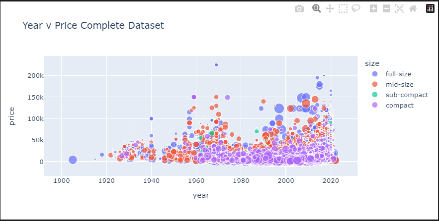
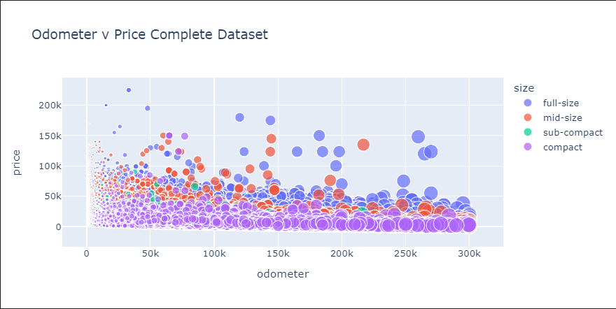
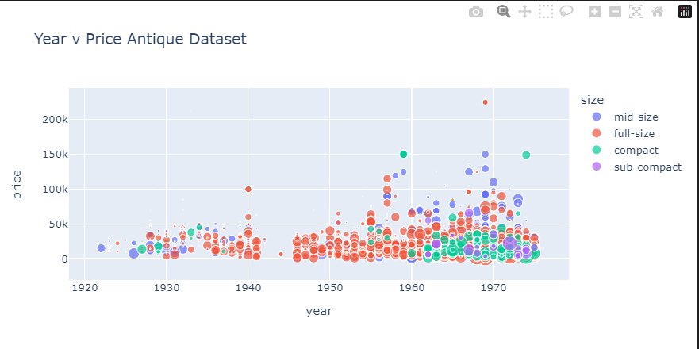
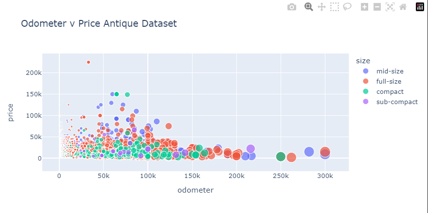
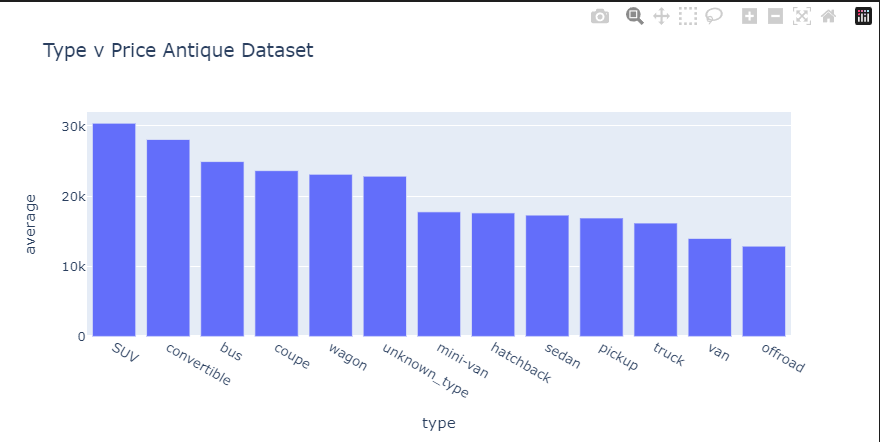
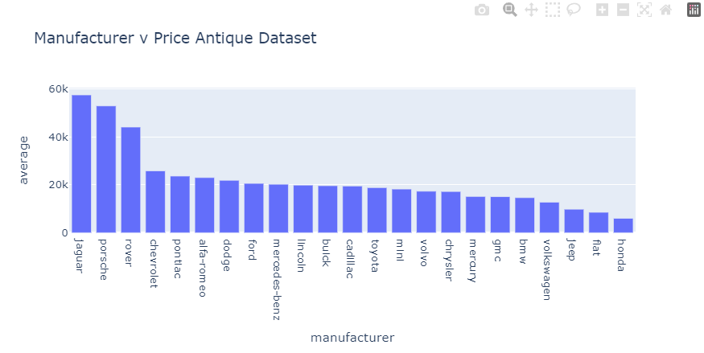
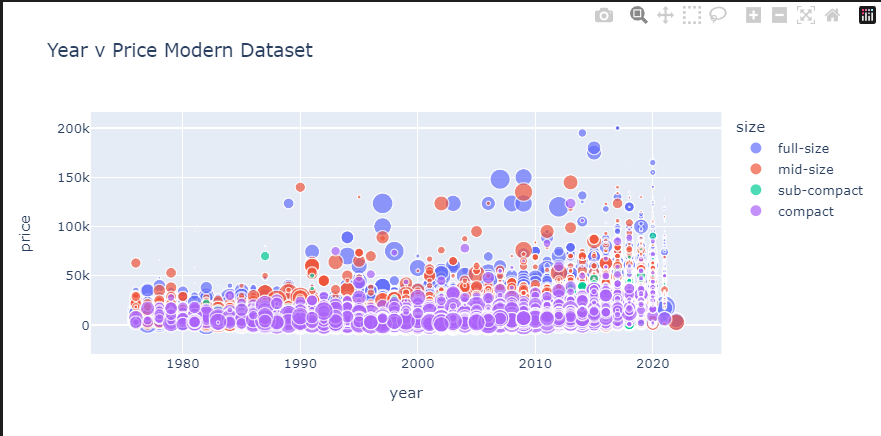
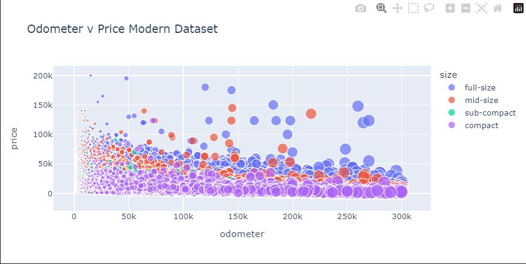
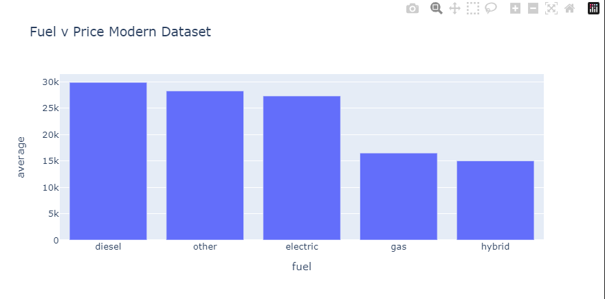
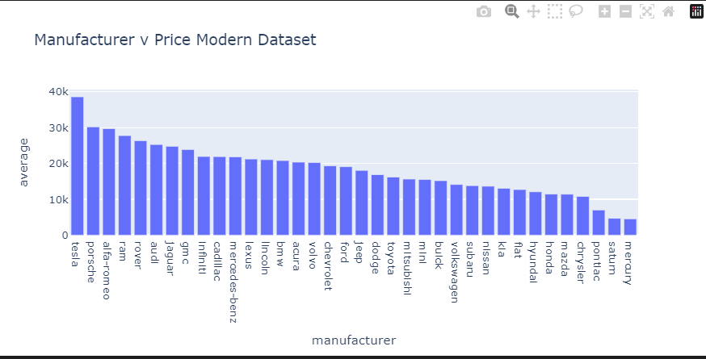

https://github.com/rmcsulla/ai/blob/main/Practical%20Application%20Assignment%2011.1/prompt_II.ipynb

As you know there is a wide variety of detail in the used car market. There is so much personal preference and ripple effect from marketing campaigns that it is difficult to see through the noise and discern which cars are in high demand and that hold value in the eyes of the customer. I've analyzed a wide variety of data for used car sales and have discovered the most important features that drive a high sale price in this segment. When the data is viewed on a whole, the primary factors in determining price are year and the mileage of the car. Newer and lower mileage having the most influence over the sale price.

When the data is seperated into segments - Antiques and modern cars the influencing factors change. Antique car prices are heavily influenced by condition, manufactuer and type.

In summary, dealers looking to maximize profits and sales price of antique cars should buy cars in the best condition possible, stick to certain types - SUV, Convertible, Bus, Coupe, Wagon and prioitize buying from certain manufacturers like Jaguar, porsche, land rover, chevrolet, pontiac etc.

Modern car data follows the general trend of being heavily influenced by year and mileage but also the fuel type and manufacturer come into play more heavily.

When dealing in modern cars, diesel and electric cars are demanding the highest sale price. Brands such as Tesla (specializing in electric cars) may be desirable to focus on as well as other well known brands like porsche, alfa romea, ram, rover and audit. Additionally, my comments about the complete set of cars, not just modern applies here as well. newer cars with low mileage are always preferable to deal in.

