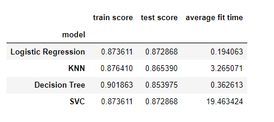

The data was accumulated through 17 marketing campaigns. 

The goal of this work is to try to determine the features of a targeted marketing campaign that might lead to a more successful conversion rate for customers that 'subscribe to a term deposit'. Knowing how these features can predict this outcome can help marketers focus on the key behaviors necessary and minimize the costs associated with the campaign.

The data itself had many values that needed to be cleaned up with 'unknown' values.

After dropping those entries and determining the independent and target variables, I one hot encoded categorical features and applied scaling before creating training and test data sets.

Establishing a baseline using the dummy classifier resulted in a score of 0.8728680136447127.

Building out a Logistic Ression model with defautl parameters resulted in a run time of 0.19906187057495117 seconds and scores for training and test sets of 0.8728680136447127 and 0.8736114755532232. This leads me to beleive that the dummyclassifier msut be using Logistic regression under the hood as the scores matched.

I continued to build out different models using the same pipeline with the following results:

In order to improve the model I build out parameter sets for each type of model and used gridsearch to identify optimal parameters for my data.

The test and train scores and optimal parameters are as followsd:

**logistic regression:**
Test: 0.8728680136447127
Train: 0.8736114755532232
Best Score: 0.8735677396203319
Penalty: l1
Solver: liblinear

**KNN**
Test: 0.8723432170034112
Train: 0.8734802763928977
Best Score: 0.8733053776319266
n_neighbors: 50

**Decision Tree**
Test: 0.8728680136447127
Train: 0.8736114755532232
Best Score: 0.8736114745864374
Criterion: gini

**SVC**
Test: 0.8728680136447127
Train: 0.8736114755532232
Best Score: 0.8736114745864374
Kernel: rbf
Gamma: scale

In the end my gridsearch resulted in only marginal improvements over the dummy classfier or logistic ression with defaults.