# Practical Application Assignment 5.1

Carry Out Coupon
Accepted :1682
Total :2280
Proportion: 0.7377

**Those that carry away more than 3 times or fewer than 3 times have approximately similar acceptance rates:**

- ***Three or fewer*** acceptance rate : 0.7235
- ***More than three*** acceptance rate : 0.7475

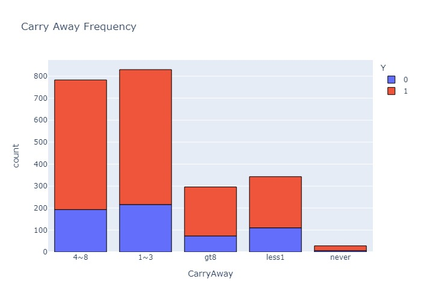

**There does not appear to be much variance in carry away acceptance rates when age is divided between those younger and older than 40:**

- Carry out ***younger than 40*** acceptance rate : 0.7333
- Carry out ***older than 40*** acceptance rate : 0.7484

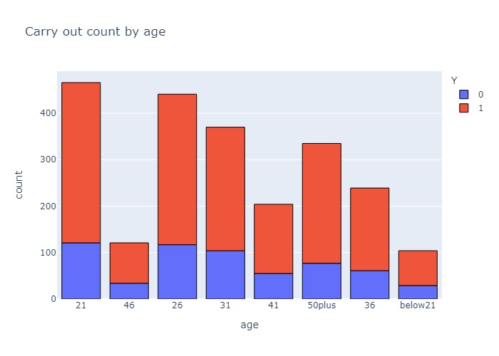

**There does not appear to be much variance in carry away acceptance when passenger type 'alone' is compared to other types:**

- Carry out ***alone*** acceptance rate : 0.7318
- Carry out not ***alone*** acceptance rate : 0.7460

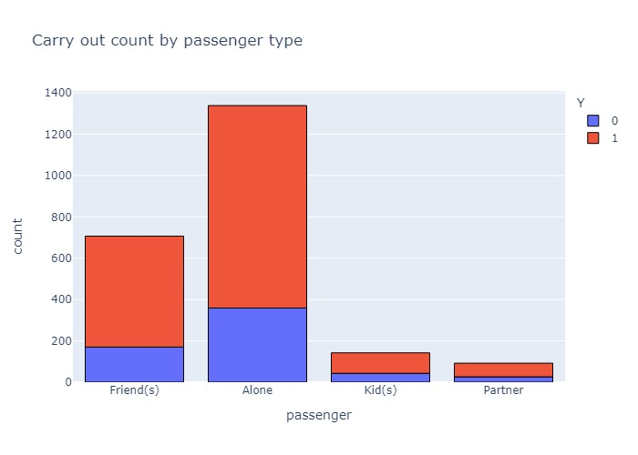

**There is a slightly higher amount of wealthier people accepting coupons:**

- Carry ***income more than 50k*** acceptance rate : 0.7530
- Carry ***income less than 50k*** acceptance rate : 0.7202

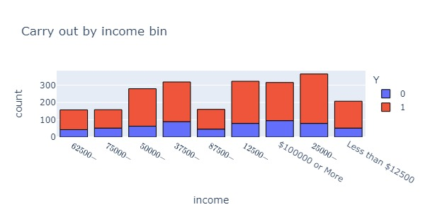

**People accepted the coupon at much higher rates when the weather was nice:**

- Carry out ***sunny*** acceptance rate : 0.7640
- Carry out ***not sunny*** acceptance rate : 0.6627

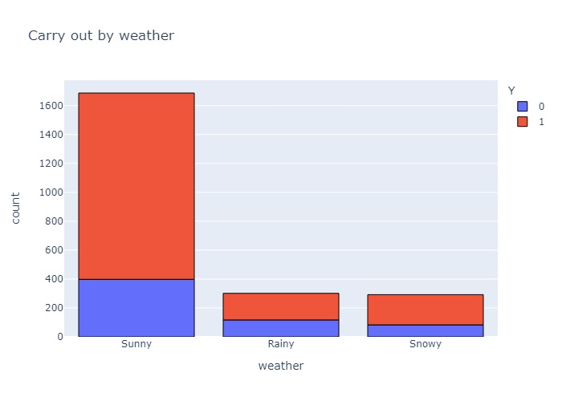

**When the recipient's destination was not urgent, they accepted the coupons at a slightly higher rate:**

- Carry out ***not urgent*** destination acceptance rate : 0.7615
- Carry out ***home or work*** destination acceptance rate : 0.7212

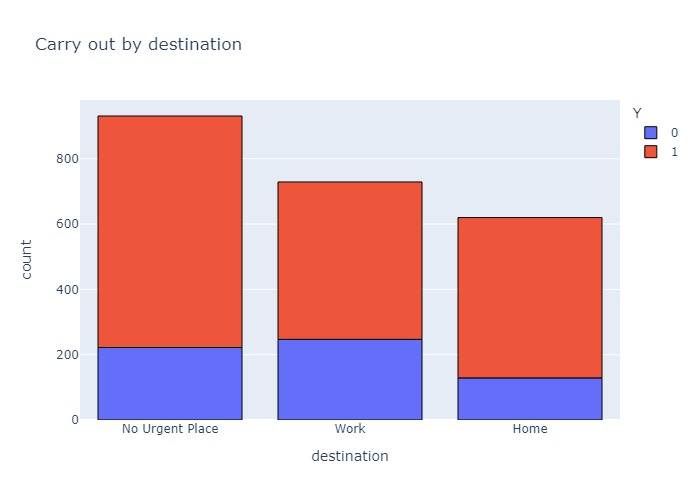

**Recipients accepted the coupon at a much higher rate in the afternoon and evening than the morning:**

- Carry out ***morning*** acceptance rate : 0.6767
- Carry out ***afternoon*** acceptance rate : 0.8077

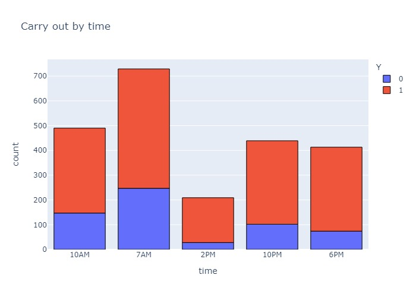

**Male recipients accepted the coupon at a higher rate than females:**

- Carry out ***male*** acceptance rate : 0.7617
- Carry out ***female*** acceptance rate : 0.7151

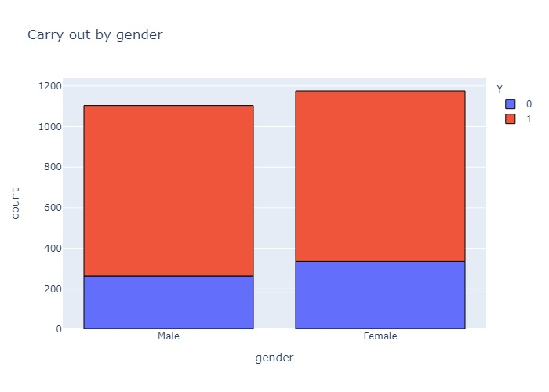

**There appears to be no major difference in acceptance rate based on parental status:**

- Carry out ***has children*** acceptance rate : 0.7388
- Carry out ***does not have children*** acceptance rate : 0.7368

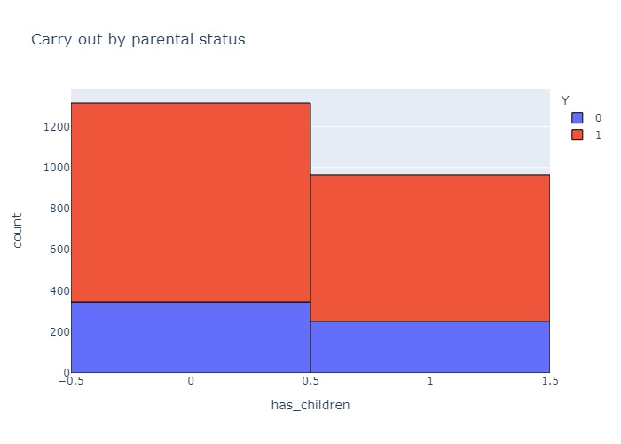

**Those with college degrees had a slightly higher acceptance rate:**

- Carry out ***college degree*** acceptance rate : 0.7607
- Carry out ***no college degree*** acceptance rate : 0.7205

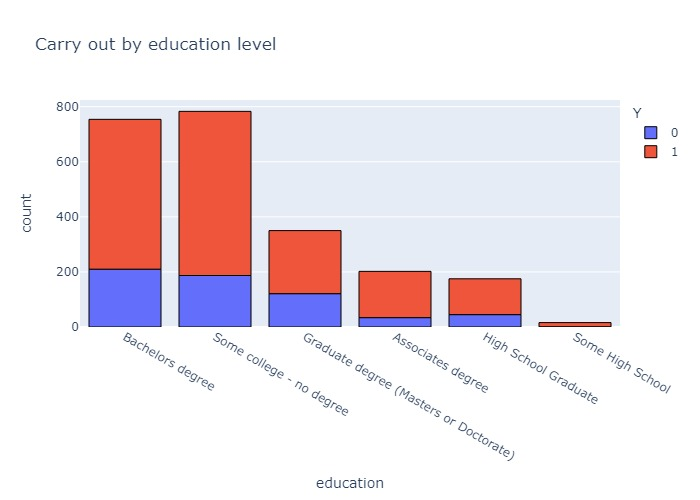

**Some occupations had very high acceptance rates but made up a smaller than average portion of the population:**

- Building and Grounds 100% acceptance, 9 people
- Protective Service 96.77% acceptance, 31 people
- Construction and Extraction 96.42% acceptance, 28 people
- Healthcare 92.5% acceptance, 40 people

**Some occupations had very low acceptance rates but made up a smaller than average portion of the population:**

- Life Physical Social Science 50% acceptance, 30 people
- Legal 53.65% acceptance, 41 people

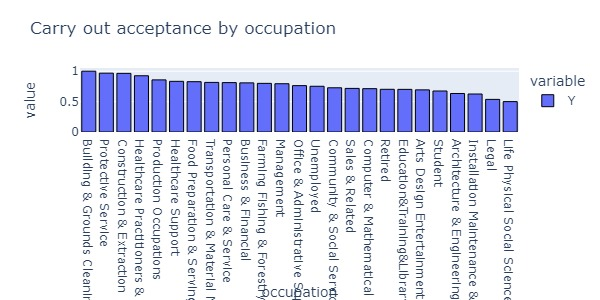
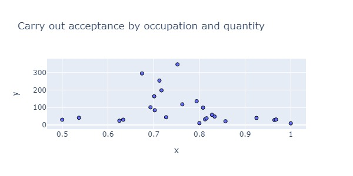

**Interestingly, people heading away from the coupon location had a slightly higher acceptance rate:**

- Carry out ***same direction*** acceptance rate : 0.7058
- Carry out ***different direction*** acceptance rate : 0.7536

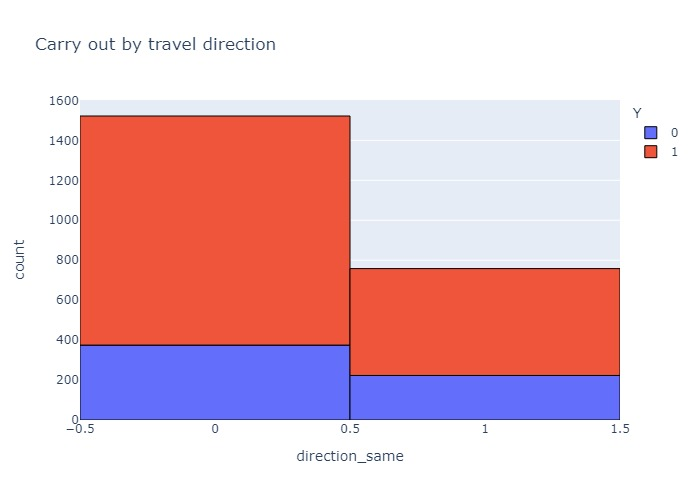

Many of these binary comparisions ended up with very close acceptance rates. The exploration of acceptance by occupation appeared to be promiosiung at first, but when the outliers were explored they represented a small portion of the total peopel int he data set. Arguably the two biggest factors imapcting coupon acceptance for the carry out category are the timing - afternoon 80.77% and the weather - sunny at 76%. Compared with the average in the total data (73.77%) for this coupon type they appear to provide insight at a simple, binary level. 